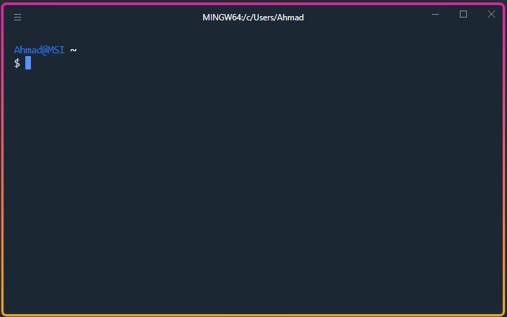

# Hyper

> My personal hyperjs terminal theme configuration



## Edit hyper config

Open hyper config by clicking on `edit > preferances`, or you can find the configuration in

```
C:\Users\{USER}\AppData\Roaming\Hyper
```

## Edit git bash prompt

Open `git-prompt.sh` file in

```
C:\Program Files\Git\etc\profile.d\git-prompt.sh
```

Put comment on line 16 and 17 to hide the **MINGW64** text. You can also change the `user@host` in git bash here.

## Links

- [Hyper](https://hyper.is/)
- [Awesome Hyper](https://github.com/bnb/awesome-hyper#customization)
